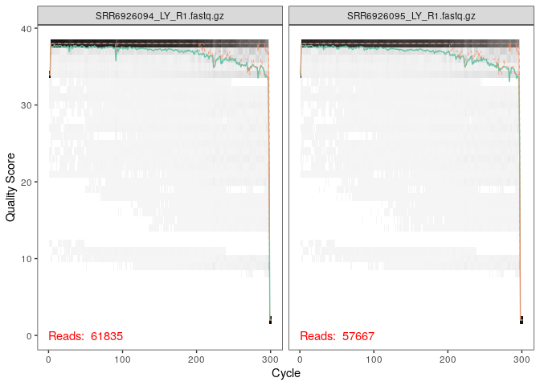
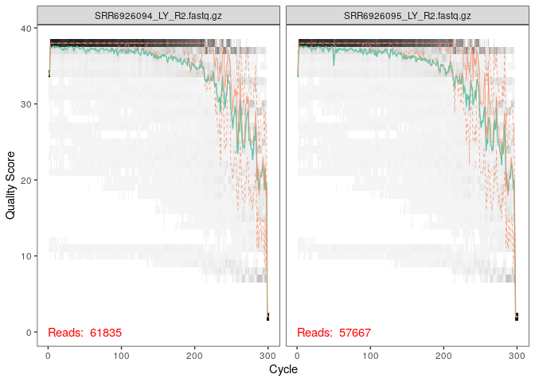
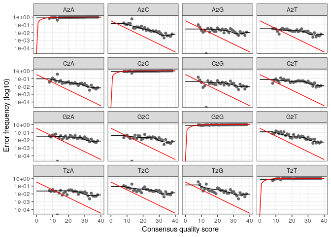
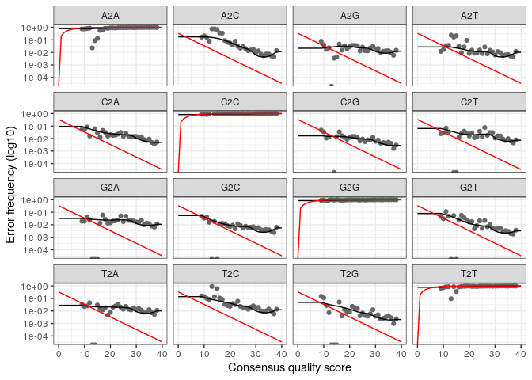

CC3 Microbiote des vaches laitières
================

  - [Définir les noms de fichiers pour les fichiers fastq.gz
    filtrés](#définir-les-noms-de-fichiers-pour-les-fichiers-fastq.gz-filtrés)
  - [Apprentissage des erreurs](#apprentissage-des-erreurs)
      - [Visualisation des modèles d’ereur du
        forward](#visualisation-des-modèles-dereur-du-forward)
      - [Exemple d’interférences](#exemple-dinterférences)
  - [Inspection des longueurs de
    séquences](#inspection-des-longueurs-de-séquences)
  - [Chimères](#chimères)
      - [Faire le ratio](#faire-le-ratio)
  - [Construction d’une table et évolution des filtres de
    qualité](#construction-dune-table-et-évolution-des-filtres-de-qualité)
      - [Assignation taxonomique n°2 Silva species
        assignement](#assignation-taxonomique-n2-silva-species-assignement)

Avec Laurianne Voland, nous avons choisi de prendre l’article “Illumina
sequencing analysis of the ruminal microbiota in high-yield and
low-yield lactating dairy cows” de J. Tong & al. Il traite le séquençage
des communautés bactériennes au sein du rumen des vaches Holstein de
faible et haut rendement. Nous avons utilisé, pour analyser les données,
la méthode de haute résolution Dada2. Nous pensons que les auteurs ne
l’ont pas utilisé mais plutôt le clustering à 97%. Nos résultats ne
correspondront donc pas forcément mais se rapprocheront de ceux de
l’article.

Nous importons les échantillons depuis ENA. Nous avons remarqué une
petite différence par rapprot à l’article. En effet, il était marqué un
prélèvement de 16 échantillons, hors nous en avons 22. De plus, nous
n’avons pas eu d’informations très claires pour différencier les
échantillons haut et bas rendement. Nous avons tout de même réalisé une
distinction entre les deux catégrories mais les résultats varient. Les
11 premiers ont été classés comme appartenant à faible rendement et les
11 derniers appartenant à haut rendement.

``` r
library(dada2)
```

    ## Loading required package: Rcpp

``` r
path <- "~/EcoG2-CC3_2/Seqreunies" # CHANGE ME to the directory containing the fastq files after unzipping.
list.files(path)
```

    ##  [1] "filtered"                  "SRR6926094_LY_R1.fastq.gz"
    ##  [3] "SRR6926094_LY_R2.fastq.gz" "SRR6926095_LY_R1.fastq.gz"
    ##  [5] "SRR6926095_LY_R2.fastq.gz" "SRR6926096_LY_R1.fastq.gz"
    ##  [7] "SRR6926096_LY_R2.fastq.gz" "SRR6926097_LY_R1.fastq.gz"
    ##  [9] "SRR6926097_LY_R2.fastq.gz" "SRR6926098_LY_R1.fastq.gz"
    ## [11] "SRR6926098_LY_R2.fastq.gz" "SRR6926099_LY_R1.fastq.gz"
    ## [13] "SRR6926099_LY_R2.fastq.gz" "SRR6926100_LY_R1.fastq.gz"
    ## [15] "SRR6926100_LY_R2.fastq.gz" "SRR6926101_LY_R1.fastq.gz"
    ## [17] "SRR6926101_LY_R2.fastq.gz" "SRR6926102_LY_R1.fastq.gz"
    ## [19] "SRR6926102_LY_R2.fastq.gz" "SRR6926103_LY_R1.fastq.gz"
    ## [21] "SRR6926103_LY_R2.fastq.gz" "SRR6926104_LY_R1.fastq.gz"
    ## [23] "SRR6926104_LY_R2.fastq.gz" "SRR6926105_LY_R1.fastq.gz"
    ## [25] "SRR6926105_LY_R2.fastq.gz" "SRR6926106_LY_R1.fastq.gz"
    ## [27] "SRR6926106_LY_R2.fastq.gz" "SRR6926107_LY_R1.fastq.gz"
    ## [29] "SRR6926107_LY_R2.fastq.gz" "SRR6926108_LY_R1.fastq.gz"
    ## [31] "SRR6926108_LY_R2.fastq.gz" "SRR6926109_LY_R1.fastq.gz"
    ## [33] "SRR6926109_LY_R2.fastq.gz" "SRR6926110_LY_R1.fastq.gz"
    ## [35] "SRR6926110_LY_R2.fastq.gz" "SRR6926111_LY_R1.fastq.gz"
    ## [37] "SRR6926111_LY_R2.fastq.gz" "SRR6926112_LY_R1.fastq.gz"
    ## [39] "SRR6926112_LY_R2.fastq.gz" "SRR6926113_LY_R1.fastq.gz"
    ## [41] "SRR6926113_LY_R2.fastq.gz" "SRR6926114_LY_R1.fastq.gz"
    ## [43] "SRR6926114_LY_R2.fastq.gz" "SRR6926115_LY_R1.fastq.gz"
    ## [45] "SRR6926115_LY_R2.fastq.gz"

``` r
# Forward and reverse fastq filenames have format: SAMPLENAME_R1_1.fastq and SAMPLENAME_R2_1.fastq
fnFs <- sort(list.files(path, pattern="_R1.fastq.", full.names = TRUE))
fnRs <- sort(list.files(path, pattern="_R2.fastq", full.names = TRUE))
# Extract sample names, assuming filenames have format: SAMPLENAME_XXX.fastq
sample.names <- sapply(strsplit(basename(fnFs), "R"), `[`, 3)
```

``` r
plotQualityProfile(fnFs[1:2])
```

<!-- -->

Des reverses (= les reads 2)

``` r
plotQualityProfile(fnRs[1:2])
```

<!-- -->

### Définir les noms de fichiers pour les fichiers fastq.gz filtrés

``` r
# Place filtered files in filtered/ subdirectory
filtFs <- file.path(path, "filtered", paste0(sample.names, "_F_filt.fastq.gz"))
filtRs <- file.path(path, "filtered", paste0(sample.names, "_R_filt.fastq.gz"))
names(filtFs) <- sample.names
names(filtRs) <- sample.names
```

``` r
out<-filterAndTrim(fnFs, filtFs, fnRs, filtRs, truncLen=c(295,180),
              maxN=0, maxEE=c(2,2), truncQ=2, rm.phix=TRUE,
              compress=TRUE, multithread=TRUE) # On Windows set multithread=FALSE
```

``` r
head(out)
```

    ##                           reads.in reads.out
    ## SRR6926094_LY_R1.fastq.gz    61835     58382
    ## SRR6926095_LY_R1.fastq.gz    57667     54105
    ## SRR6926096_LY_R1.fastq.gz    57791     54223
    ## SRR6926097_LY_R1.fastq.gz    51590     48461
    ## SRR6926098_LY_R1.fastq.gz    48471     45359
    ## SRR6926099_LY_R1.fastq.gz    52575     49360

# Apprentissage des erreurs

``` r
errF <- learnErrors(filtFs, multithread=TRUE)
```

    ## 108638175 total bases in 368265 reads from 7 samples will be used for learning the error rates.

``` r
errR <- learnErrors(filtRs, multithread=TRUE)
```

    ## 105525000 total bases in 586250 reads from 11 samples will be used for learning the error rates.

## Visualisation des modèles d’ereur du forward

En abscisse on a la probabilité des mutations et en ordonnée le q score
La fonction plotError permet de visualiser les erreurs.

``` r
plotErrors(errF, nominalQ=TRUE)
```

    ## Warning: Transformation introduced infinite values in continuous y-axis
    
    ## Warning: Transformation introduced infinite values in continuous y-axis

<!-- -->

``` r
plotErrors(errR, nominalQ=TRUE)
```

    ## Warning: Transformation introduced infinite values in continuous y-axis
    
    ## Warning: Transformation introduced infinite values in continuous y-axis

<!-- -->
Chaque mutation possible ( T→G, …) le taux d’erreur sont indiqués.
-points : les taux d’erreur observés pour chaque score de qualité du
consensus. -ligne noire : taux d’erreur estimés après convergence de
l’algorithme de la machine d’apprentissage. -ligne rouge : taux
d’erreur attendus selon la définition nominale du Q-score. Les
fenêtres montrent les replacements d’une base à une autre. Quand on
remplace les A avec les T et les T avec les A, la courbe se rapproche du
taux d’erreur attendue selon la définition du Q-score.

## Exemple d’interférences

Dans deux nouvelles variables (pour les R1 et les R2),où est appliqué la
fonction dada() avec le modèle d’erreur et les reads filtrés dont on a
enlevé les bases au délà d’un Q-score inférieur à 30.

``` r
dadaFs <- dada(filtFs, err=errF, multithread=TRUE)
```

    ## Sample 1 - 58382 reads in 29373 unique sequences.
    ## Sample 2 - 54105 reads in 29131 unique sequences.
    ## Sample 3 - 54223 reads in 29318 unique sequences.
    ## Sample 4 - 48461 reads in 25967 unique sequences.
    ## Sample 5 - 45359 reads in 24124 unique sequences.
    ## Sample 6 - 49360 reads in 25970 unique sequences.
    ## Sample 7 - 58375 reads in 28209 unique sequences.
    ## Sample 8 - 49743 reads in 25522 unique sequences.
    ## Sample 9 - 57919 reads in 31936 unique sequences.
    ## Sample 10 - 59979 reads in 30784 unique sequences.
    ## Sample 11 - 50344 reads in 24627 unique sequences.
    ## Sample 12 - 52907 reads in 26844 unique sequences.
    ## Sample 13 - 41901 reads in 24884 unique sequences.
    ## Sample 14 - 39182 reads in 23585 unique sequences.
    ## Sample 15 - 42477 reads in 19192 unique sequences.
    ## Sample 16 - 36124 reads in 20655 unique sequences.
    ## Sample 17 - 44273 reads in 25094 unique sequences.
    ## Sample 18 - 58696 reads in 26909 unique sequences.
    ## Sample 19 - 50585 reads in 24265 unique sequences.
    ## Sample 20 - 44151 reads in 24136 unique sequences.
    ## Sample 21 - 40747 reads in 23233 unique sequences.
    ## Sample 22 - 44572 reads in 24433 unique sequences.

``` r
dadaRs <- dada(filtRs, err=errR, multithread=TRUE)
```

    ## Sample 1 - 58382 reads in 26728 unique sequences.
    ## Sample 2 - 54105 reads in 27255 unique sequences.
    ## Sample 3 - 54223 reads in 27336 unique sequences.
    ## Sample 4 - 48461 reads in 25857 unique sequences.
    ## Sample 5 - 45359 reads in 22282 unique sequences.
    ## Sample 6 - 49360 reads in 26396 unique sequences.
    ## Sample 7 - 58375 reads in 28405 unique sequences.
    ## Sample 8 - 49743 reads in 27299 unique sequences.
    ## Sample 9 - 57919 reads in 28973 unique sequences.
    ## Sample 10 - 59979 reads in 28386 unique sequences.
    ## Sample 11 - 50344 reads in 23577 unique sequences.
    ## Sample 12 - 52907 reads in 24070 unique sequences.
    ## Sample 13 - 41901 reads in 23131 unique sequences.
    ## Sample 14 - 39182 reads in 24011 unique sequences.
    ## Sample 15 - 42477 reads in 19890 unique sequences.
    ## Sample 16 - 36124 reads in 20337 unique sequences.
    ## Sample 17 - 44273 reads in 25021 unique sequences.
    ## Sample 18 - 58696 reads in 25330 unique sequences.
    ## Sample 19 - 50585 reads in 26451 unique sequences.
    ## Sample 20 - 44151 reads in 21771 unique sequences.
    ## Sample 21 - 40747 reads in 22254 unique sequences.
    ## Sample 22 - 44572 reads in 23726 unique sequences.

``` r
mergers <- mergePairs(dadaFs, filtFs, dadaRs, filtRs, verbose=TRUE)
```

    ## 8075 paired-reads (in 725 unique pairings) successfully merged out of 50493 (in 15003 pairings) input.

    ## 8188 paired-reads (in 738 unique pairings) successfully merged out of 45505 (in 14079 pairings) input.

    ## 4788 paired-reads (in 424 unique pairings) successfully merged out of 46402 (in 16010 pairings) input.

    ## 7031 paired-reads (in 412 unique pairings) successfully merged out of 40202 (in 11400 pairings) input.

    ## 5989 paired-reads (in 446 unique pairings) successfully merged out of 38304 (in 10079 pairings) input.

    ## 6886 paired-reads (in 553 unique pairings) successfully merged out of 41647 (in 11719 pairings) input.

    ## 11012 paired-reads (in 850 unique pairings) successfully merged out of 50195 (in 13073 pairings) input.

    ## 6033 paired-reads (in 474 unique pairings) successfully merged out of 42697 (in 12462 pairings) input.

    ## 7610 paired-reads (in 779 unique pairings) successfully merged out of 48275 (in 16019 pairings) input.

    ## 8689 paired-reads (in 742 unique pairings) successfully merged out of 51544 (in 14751 pairings) input.

    ## 7851 paired-reads (in 660 unique pairings) successfully merged out of 43388 (in 10719 pairings) input.

    ## 6839 paired-reads (in 538 unique pairings) successfully merged out of 45516 (in 11986 pairings) input.

    ## 5719 paired-reads (in 399 unique pairings) successfully merged out of 34480 (in 10550 pairings) input.

    ## 4519 paired-reads (in 322 unique pairings) successfully merged out of 31698 (in 9656 pairings) input.

    ## 5378 paired-reads (in 345 unique pairings) successfully merged out of 37008 (in 8501 pairings) input.

    ## 4596 paired-reads (in 329 unique pairings) successfully merged out of 29590 (in 8413 pairings) input.

    ## 4444 paired-reads (in 283 unique pairings) successfully merged out of 36418 (in 10969 pairings) input.

    ## 8794 paired-reads (in 697 unique pairings) successfully merged out of 51637 (in 13336 pairings) input.

    ## 7488 paired-reads (in 635 unique pairings) successfully merged out of 43852 (in 11335 pairings) input.

    ## 7498 paired-reads (in 570 unique pairings) successfully merged out of 37249 (in 10385 pairings) input.

    ## 6197 paired-reads (in 491 unique pairings) successfully merged out of 33692 (in 9298 pairings) input.

    ## 6450 paired-reads (in 489 unique pairings) successfully merged out of 37419 (in 11060 pairings) input.

``` r
# Inspect the merger data.frame from the first sample
head(mergers[[1]])
```

    ##                                                                                                                                                                                                                                                                                                                                                                                                                                                                       sequence
    ## 5  CAGATCACTCCTACGGGAGGCAGCAGTGGGGAATATTGGGCAATGGGCGAAAGCCTGACCCAGCAACGCCGCGTGAAGGAAGAAGGTCTTCGGATTGTAAACTTCTTTTATGAGGGACGAAGGACGTGACGGTACCTCATGAATAAGCCACGGCTAACTACGTGCCAGCAGCCGCGGTAATACGTAGGTGGCAAGCGTTATCCGGATTTACTGGGTGTAAAGGGCGCGTAGGCGGGGATGCAAGTCAGATGTGAAATCTATGGGCTTAACTCATAAACTGCATTTGAAACTGTATCTCTTGAGTGCTGGAGAGGTAGACGGAATTCCTTGTGTAGCGGTGAAATGCGTAGATATAAGGAAGAACACCAGTGGCGAAGGCGGTCTACTGGACAGTAACTGACGCTGAGGCGCGAGAGCGTGGGGAGCAAACAGGATTAGATACCCCAGTAGTCCTTTCAC
    ## 8    CAGATCACTCCTACGGGAGGCAGCAGTGGGGAATATTGGACAATGGGGGAAACCCTGATCCAGCGACGCCGCGTGAGTGAAGAAGTATTTCGGTATGTAAAGCTCTATCAGCAGGGAAGATGATGACGGTACCTGACTAAGAAGCACCGGCTAAATACGTGCCAGCAGCCGCGGTAATACGTATGGTGCAAGCGTTATCCGGATTTACTGGGTGTAAAGGGAGCGTAGGCGGCCGTGCAAGTCAGGTGTGAAATCCCGGGGCTCAACCCCGGTACTGCACTTGAAACTGCGTGGCTGGAGTACAGGAGAGGCAGGCGGAATTCCTAGTGTAGCGGTGAAATGCGTAGATATTAGGAAGAACACCGGTGGCGAAGGCGGCCTGCTGGACTGGATACTGACGCTGAGGCTCGAAAGCGTGGGGAGCAAACAGGATTAGAAACCCTAGTAGTCCTTTCAC
    ## 12 CAGATCACTCCTACGGGAGGCAGCAGTGGGGAATATTGGGCAATGGGCGAAAGCCTGACCCAGCAACGCCGCGTGAAGGAAGAAGGTCTTCGGATTGTAAACTTCTTTTATGAGGGACGAAGGACGTGACGGTACCTCATGAATAAGCCACGGCTAACTACGTGCCAGCAGCCGCGGTAATACGTAGGTGGCAAGCGTTATCCGGATTTACTGGGTGTAAAGGGCGCGTAGGCGGGGATGCAAGTCAGATGTGAAATCTATGGGCTTAACTCATAAACTGCATTTGAAACTGTATCTCTTGAGTGCTGGAGAGGTAGACGGAATTCCTTGTGTAGCGGTGAAATGCGTAGATATAAGGAAGAACACCAGTGGCGAAGGCGGTCTACTGGACAGTAACTGACGCTGAGGCGCGAAAGCGTGGGGAGCAAACAGGATTAGAAACCCGAGTAGTCCTTTCAC
    ## 15 CAGATCACTCCTACGGGAGGCAGCAGTGGGGAATATTGGGCAATGGGCGAAAGCCTGACCCAGCAACGCCGCGTGAAGGAAGAAGGTCTTCGGATTGTAAACTTCTTTTATGAGGGACGAAGGACGTGACGGTACCTCATGAATAAGCCACGGCTAACTACGTGCCAGCAGCCGCGGTAATACGTAGGTGGCAAGCGTTATCCGGATTTACTGGGTGTAAAGGGCGCGTAGGCGGGGATGCAAGTCAGATGTGAAATCTATGGGCTTAACTCATAAACTGCATTTGAAACTGTATCTCTTGAGTGCTGGAGAGGTAGACGGAATTCCTTGTGTAGCGGTGAAATGCGTAGATATAAGGAAGAACACCAGTGGCGAAGGCGGTCTACTGGACAGTAACTGACGCTGAGGCGCGAGAGCGTGGGGAGCAAACAGGATTAGAAACCCCAGTAGTCCTTTCAC
    ## 18  CAGATCACTCCTACGGGAGGCAGCAGTGGGGAATATTGGGCAATGGGCGAAAGCCTGACCCAGCAACGCCGCGTGAAGGATGACGGTCTTCGGATTGTAAACTTCTTTAATTGGGGAAGAACAAAATGACCTACCCAAAGAATAAGTCACGGCTAACTACGTGCCAGCAGCCGCGGTAATACGTAGGTGACAAGCGTTATCCGGATTTACTGGGCGTAAAGGGCGTGTAGGCGGTCTTGCAAGTCAGAAGTGAAATTCCTGAGCTCAACTCGGGCGCTGCTTCTGAAACTGCAGGACTTGAGTGCTGGAGGGGATAGCGGAATTCCTAGTGGAGCGGTAAAATGCGCAGATATTAGGAAGAACACCGGTGGCGAAGGCGGCTATCTGGACAGTAACTGACGCTGAGGCGCGAAAGCGTGGGGAGCAAACAGGATTAGAAACCCCAGTAGTCCTTTCAC
    ## 21    CAGATCACTCCTACGGGAGGCAGCAGTGGGGAATATTGCACAATGGGGGAAACCCTGATGCAGCGACGCCGCGTGAGTGAAGAAGCATTTCGGTGCGTAAAGCTCTGTCAGCAGGAAAGAAAATGACGGTACCTGACCAAGAAGCCCCGGCTAACTACGTGCCAGCAGCCGCGGTAATACGTAGGGGGCAAGCGTTATCCGGATTTACTGGGTGTAAAGGGAGCGTAGACGGCGAAGCAAGTCTGAAGTGAAAGGCCGGGGCCCAACCCCGGGACTGCTTTGGAAACTGTTTTGCTTGAGTGCGGGAGGGGTAAGCGGAATTCCTAGTGTAGCGGTGAAATGCGTAGATATTAGGAGGAACACCGGTGGCGAAGGCGGCTTACTGGACCGTAACTGACGTTGAGGCTCGAAGGCGTGGGGAGCAAACAGGATTAGAAACCCGAGTAGTCCTTTCAC
    ##    abundance forward reverse nmatch nmismatch nindel prefer accept
    ## 5         99      10     435     16         0      0      1   TRUE
    ## 8         98      69      63     18         0      0      1   TRUE
    ## 12        87      10     316     16         0      0      1   TRUE
    ## 15        79      10      39     16         0      0      1   TRUE
    ## 18        76      77      95     17         0      0      1   TRUE
    ## 21        73      91     114     19         0      0      1   TRUE

On a appliqué la fonction mergePairs() qui permet d’associer les R1 et
le R2 par paires de lecture sans bruit (filtrés) en éliminant les reads
qui ne chevauchent pas assez (overlap) ou justement ceux qui ont une
trop grande disconcordance dans ce chevauchement.

``` r
seqtab <- makeSequenceTable(mergers)
dim(seqtab)
```

    ## [1]    22 10642

# Inspection des longueurs de séquences

On va constuire une table avec des variants, on obtient alors des
séquences avec une meilleure résolution par rapport table d’OTU

``` r
table(nchar(getSequences(seqtab)))
```

    ## 
    ##  440  455  456  457  458  459  460  461  462  463 
    ##    1  326 4166  751 1761 1352  945   96  980  264

Ce tableau contient les séquences correspondant ainsi à la longueur de
la région V4 et V5 de l’ARN 16S amplifiée.

# Chimères

Cette fonction permet d’enlever les chimères par méthode consensus

``` r
seqtab.nochim <- removeBimeraDenovo(seqtab, method="consensus", multithread=TRUE, verbose=TRUE)
```

    ## Identified 6826 bimeras out of 10642 input sequences.

``` r
dim(seqtab.nochim)
```

    ## [1]   22 3816

## Faire le ratio

Voir le nombre de chimères, c’est le pourcentage de chimères dans notre
échantillon

``` r
1- sum(seqtab.nochim)/sum(seqtab)
```

    ## [1] 0.3166704

Ici, on obtient 31% de chimères, l’alignement a bien été réalisé.

# Construction d’une table et évolution des filtres de qualité

``` r
getN <- function(x) sum(getUniques(x))
track <- cbind(out, sapply(dadaFs, getN), sapply(dadaRs, getN), sapply(mergers, getN), rowSums(seqtab.nochim))
# If processing a single sample, remove the sapply calls: e.g. replace sapply(dadaFs, getN) with getN(dadaFs)
colnames(track) <- c("input", "filtered", "denoisedF", "denoisedR", "merged", "nonchim")
rownames(track) <- sample.names
head(track)
```

    ##             input filtered denoisedF denoisedR merged nonchim
    ## 6926094_LY_ 61835    58382     52474     55970   8075    5475
    ## 6926095_LY_ 57667    54105     47639     51508   8188    5230
    ## 6926096_LY_ 57791    54223     48415     51750   4788    3633
    ## 6926097_LY_ 51590    48461     42157     46011   7031    5064
    ## 6926098_LY_ 48471    45359     39772     43525   5989    4515
    ## 6926099_LY_ 52575    49360     43677     46888   6886    4679

Cete étape permet d’obtenir chacun de nos échantillons. Cela permet de
voir les différentes étapes de la filtration de nos données jusqu’à
l’éminination des chimères.

\#Assignation taxonomique

Nous avons choisi d’assigner une taxonomie d’après la base de données
Silva. Encore une fois, nous n’avons pas d’information sur la base de
données utilisée.

``` r
library(dada2)
taxa <- assignTaxonomy(seqtab.nochim, "~/EcoG2-CC2/silva_nr99_v138_train_set.fa.gz", multithread=TRUE)
```

On va comparer les séquences de nos échantillons grâce à la base de
données Silva.

## Assignation taxonomique n°2 Silva species assignement

``` r
taxa <- addSpecies(taxa, "~/EcoG2-CC2/silva_species_assignment_v138.fa.gz")
```

``` r
taxa.print <- taxa # Removing sequence rownames for display only
rownames(taxa.print) <- NULL
head(taxa.print)
```

    ##      Kingdom    Phylum            Class                
    ## [1,] "Bacteria" "Firmicutes"      "Clostridia"         
    ## [2,] "Bacteria" "Firmicutes"      "Clostridia"         
    ## [3,] "Bacteria" "Firmicutes"      "Clostridia"         
    ## [4,] "Bacteria" "Firmicutes"      "Clostridia"         
    ## [5,] "Bacteria" "Patescibacteria" "Gracilibacteria"    
    ## [6,] "Bacteria" "Proteobacteria"  "Gammaproteobacteria"
    ##      Order                         Family                Genus               
    ## [1,] "Lachnospirales"              "Lachnospiraceae"     "Pseudobutyrivibrio"
    ## [2,] "Oscillospirales"             "Oscillospiraceae"    "NK4A214 group"     
    ## [3,] "Lachnospirales"              "Lachnospiraceae"     "Pseudobutyrivibrio"
    ## [4,] "Lachnospirales"              "Lachnospiraceae"     "Pseudobutyrivibrio"
    ## [5,] "Absconditabacteriales (SR1)" NA                    NA                  
    ## [6,] "Aeromonadales"               "Succinivibrionaceae" "Succinivibrio"     
    ##      Species
    ## [1,] NA     
    ## [2,] NA     
    ## [3,] NA     
    ## [4,] NA     
    ## [5,] NA     
    ## [6,] NA

Après cette assignation taxonomique, nous retrouvons majoritairement des
Firmicutes. L’assignation va en grande majorité jusqu’au genre. De
nombreux clades ont été crées pour assigner les séquences provenant du
rumen. La variable taxa.print a reçu toutes les séquences des
échantillons avec une taxonomie assignée. Finalement 3816 taxa ont été
retrouvés.

``` r
save.image(file="02_data_analysis_FinalEnv")
```
