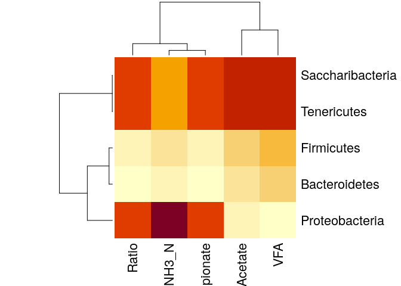
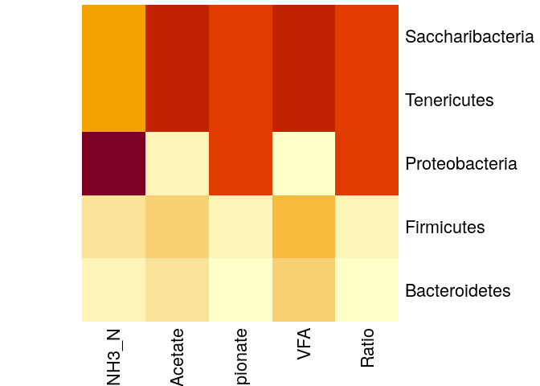

CC3 Microbiote des vaches laitières
================

  - [Tests effectués à partir des tables de
    l’article.](#tests-effectués-à-partir-des-tables-de-larticle.)
      - [Bar plot d’abondance au niveau des
        phyla](#bar-plot-dabondance-au-niveau-des-phyla)
      - [Bar plot d’abondance au niveau des
        genres](#bar-plot-dabondance-au-niveau-des-genres)
      - [Visualisation en pie charts](#visualisation-en-pie-charts)
          - [Pie chart d’abondance au niveau des genres de high
            yield](#pie-chart-dabondance-au-niveau-des-genres-de-high-yield)
          - [Pie chart d’abondance au niveau des genres de low
            yield](#pie-chart-dabondance-au-niveau-des-genres-de-low-yield)
          - [Pie chart d’abondance au niveau des phyla de high
            yield](#pie-chart-dabondance-au-niveau-des-phyla-de-high-yield)
          - [Pie chart d’abondance au niveau des phyla de low
            yield](#pie-chart-dabondance-au-niveau-des-phyla-de-low-yield)
      - [Test de student et abondance](#test-de-student-et-abondance)
          - [Création d’une table pour l’abondance relative des
            genres](#création-dune-table-pour-labondance-relative-des-genres)
          - [Calcul des P-value avec le test de
            Student](#calcul-des-p-value-avec-le-test-de-student)
      - [Heat map](#heat-map)
          - [Création de tableau pour les genres de rendement “High
            yields”](#création-de-tableau-pour-les-genres-de-rendement-high-yields)
          - [Construction d’une heatmap pour les “high
            yield”](#construction-dune-heatmap-pour-les-high-yield)
          - [Création de tableau pour les genres de rendement “Low
            yields”](#création-de-tableau-pour-les-genres-de-rendement-low-yields)
          - [Construction d’une heatmap pour les “low
            yield”](#construction-dune-heatmap-pour-les-low-yield)
      - [Corrélation de Pearson](#corrélation-de-pearson)
          - [Au niveau des Phyla](#au-niveau-des-phyla)
      - [Les intervalles de confiance](#les-intervalles-de-confiance)
          - [Calcul de la P-value](#calcul-de-la-p-value)
          - [Les différences de proportion entre les low yield et les
            high
            yield](#les-différences-de-proportion-entre-les-low-yield-et-les-high-yield)
  - [Discussion :](#discussion)

``` r
library(ggplot2)
library(dada2)
```

    ## Loading required package: Rcpp

``` r
library(phyloseq)
library(Biostrings)
```

    ## Loading required package: BiocGenerics

    ## Loading required package: parallel

    ## 
    ## Attaching package: 'BiocGenerics'

    ## The following objects are masked from 'package:parallel':
    ## 
    ##     clusterApply, clusterApplyLB, clusterCall, clusterEvalQ,
    ##     clusterExport, clusterMap, parApply, parCapply, parLapply,
    ##     parLapplyLB, parRapply, parSapply, parSapplyLB

    ## The following objects are masked from 'package:stats':
    ## 
    ##     IQR, mad, sd, var, xtabs

    ## The following objects are masked from 'package:base':
    ## 
    ##     anyDuplicated, append, as.data.frame, basename, cbind, colnames,
    ##     dirname, do.call, duplicated, eval, evalq, Filter, Find, get, grep,
    ##     grepl, intersect, is.unsorted, lapply, Map, mapply, match, mget,
    ##     order, paste, pmax, pmax.int, pmin, pmin.int, Position, rank,
    ##     rbind, Reduce, rownames, sapply, setdiff, sort, table, tapply,
    ##     union, unique, unsplit, which, which.max, which.min

    ## Loading required package: S4Vectors

    ## Loading required package: stats4

    ## 
    ## Attaching package: 'S4Vectors'

    ## The following object is masked from 'package:base':
    ## 
    ##     expand.grid

    ## Loading required package: IRanges

    ## 
    ## Attaching package: 'IRanges'

    ## The following object is masked from 'package:phyloseq':
    ## 
    ##     distance

    ## Loading required package: XVector

    ## 
    ## Attaching package: 'Biostrings'

    ## The following object is masked from 'package:base':
    ## 
    ##     strsplit

``` r
library(DECIPHER)
```

    ## Loading required package: RSQLite

# Tests effectués à partir des tables de l’article.

Bien qu’il y ait eu peu d’informations sur les séquences, des tables
avec l’abondance des phyla et des genres ainsi qu’une table avec les
composés présent chez les deux rendements. Nous les avons exploité pour
la suite du compte-rendu car nous étions dans l’incapacité de trouver
nous même.

## Bar plot d’abondance au niveau des phyla

Nous avons crée un table assossiant les rendements avec l’abondance des
phyla.

``` r
Table_ar_phyl <- structure(list(Sample = structure(1:2, .Label = c("HY", "LY"), class = "factor"), 
                     saccharibacteria   = c(1.07,0.79),
                     tenericutes= c(1.32,1.57),
                      proteobacteria    = c(0.93,2.09),
                      firmicutes    = c(44.33,27.71),
                      bacteroidetes= c(49.1,65.61)),.Names = c("Rendement", "saccharibacteria", "tenericutess", "proteobacteria","firmicutes"," bacteroidetes"), class = "data.frame", row.names = c("1", "2"))


library(reshape2)
Table_ar_phyl_long <- melt(Table_ar_phyl, id.vars = "Rendement", variable.name = "Phyla")

g <- ggplot(Table_ar_phyl_long, aes(x = Rendement, y = value, fill = Phyla)) + 
    geom_bar(stat = "identity", width=0.4) +  scale_fill_brewer(palette = "Dark2", aes(fill = Phyla))
g + labs(fill = "Phyla")
```

<!-- -->

Nous avons fait des bar plots. Avec leur données, nous arrivons au
quasiment au même résultat dans le même ordre, il manque juste les
“others” qui n’étaient pas indiqués dans la table .

## Bar plot d’abondance au niveau des genres

Nous avons crée un table assossiant les rendements avec l’abondance des
genres.

``` r
Table_ar_genre <- structure(list(Sample = structure(1:2, .Label = c("HY", "LY"), class = "factor"), 
                     Eubacterium_coprostanoligenes_group= c(1.93,0.80),
                     Ruminococcaceae_UCG_014 = c(1.87,1.99),
                     Lachnospiraceae_NK3A20_group   = c(2.91,1.18),
                     Prevotellaceae_UCG_003 = c(2.00,2.20), 
                     Christensenellaceae_R_7_group = c(3.12,2.00),
                     Rikenellaceae_RC9_gut_group = c(2.67,2.87),
                     Bacteroidales_BS11 = c(3.36,2.21),
                     Ruminococcus = c(4.41,1.36),   
                     Bacteroidales_S24_7_group = c(3.55,3.44),
                     Prevotella_7   = c(0.47,8.41),
                     Prevotellaceae = c(4.21,5.96),
                     Succiniclasticum   = c(7.69,3.57),
                     Ruminococcaceae_NK4A214_group = c(7.20, 4.12),
                     Prevotella_1= c(29.14,37.48)),.Names = c("Rendement","Eubacterium_coprostanoligenes_group","Prevotellaceae_UCG_001","PRuminococcaceae_UCG_014","achnospiraceae-NK3A20-group","Prevotellaceae_UCG_003","Christensenellaceae_R_7_group","Bacteroidales_BS11","Rikenellaceae_RC9_gut_group","Ruminococcus","Bacteroidales_S24_7_group","Prevotellaceae","Succiniclasticum","Ruminococcaceae-NK4A214-group","Prevotella_1"), class = "data.frame", row.names = c("1", "2"))

library(reshape2)
Table_ar_genre_long <- melt(Table_ar_genre, id.vars = "Rendement", variable.name = "Genus")

q <-ggplot(Table_ar_genre_long, aes(x = Rendement, y = value, fill = Genus)) + 
    geom_bar(stat = "identity", width=0.4) + scale_fill_manual(values = c("#FF0000","#000000","#0000FF","#C0C0C0","#FFFFFF","#FFFF00","#00FFFF","#FFA500","#00FF00","#808080","#FF00FF","#800080","#FDD017","#0000A0","#3BB9FF"))
q + labs(fill = "Genus")
```

<!-- -->

Nous avons fait des bar plots. Avec leur données, nous arrivons
quasiement au même résultat dans le même ordre, il manque juste les
“others” qui n’étaient pas indiqués dans la table.

## Visualisation en pie charts

Nous avons ensuite choisi d’ajouter des pie charts car ils représentent
bien l’abondance des différents genres puis des phyla.

À partir des tables, nous avons séparés les rendement “high yield” et
“low yield” pour chaque rang taxonomique.

### Pie chart d’abondance au niveau des genres de high yield

``` r
# Load ggplot2
library(ggplot2)

# Create Data
dataHY_gen <- data.frame(
  Genus_High_yield=c("Prevotella_1", "Ruminococcaceae_NK4A214_group", "Succiniclasticum", "Prevotellaceae", "Prevotella_7", "Bacteroidales_S24_7_group", "Ruminococcus_2", "Bacteroidales_BS11", "Rikenellaceae_RC9_gut_group", "Christensenellaceae_R_7_group", "Prevotellaceae_UCG_003", "Lachnospiraceae_NK3A20_group", "Ruminococcaceae_UCG_014", "Prevotellaceae_UCG_001",
 "Eubacterium_coprostanoligenes_group"),
  count=c(29.14, 7.20, 7.69, 4.21, 0.47, 3.55, 4.41, 3.36, 2.67, 3.12, 2.00, 2.91, 1.87, 1.36, 1.93), 60, 30)

# Basic piechart
ggplot(dataHY_gen, aes(x="", y=count, fill=Genus_High_yield)) +
  geom_bar(stat="identity", width=1, color="white") +
  coord_polar("y", start=0) +
  
  theme_void() # remove background, grid, numeric labels
```

<!-- -->

### Pie chart d’abondance au niveau des genres de low yield

``` r
# Load ggplot2
library(ggplot2)

# Create Data
dataLY_gen <- data.frame(
  Genus_Low_yield=c("Prevotella_1", "Ruminococcaceae_NK4A214_group", "Succiniclasticum", "Prevotellaceae", "Prevotella_7", "Bacteroidales_S24_7_group", "Ruminococcus_2", "Bacteroidales_BS11", "Rikenellaceae_RC9_gut_group", "Christensenellaceae_R_7_group", "Prevotellaceae_UCG_003", "Lachnospiraceae_NK3A20_group", "Ruminococcaceae_UCG_014", "Prevotellaceae_UCG_001",
 "Eubacterium_coprostanoligenes_group"),
  count=c(37.48, 4.12, 3.57, 5.96, 8.41, 3.44, 1.36, 2.21, 2.87, 2.00, 2.20, 1.18, 1.99, 1.55, 0.80))

# Basic piechart
ggplot(dataLY_gen, aes(x="", y=count, fill=Genus_Low_yield)) +
  geom_bar(stat="identity", width=1, color="white") +
  coord_polar("y", start=0) +
  
  theme_void() # remove background, grid, numeric labels
```

<!-- -->

``` r
#phylum 
```

### Pie chart d’abondance au niveau des phyla de high yield

``` r
# Load ggplot2
library(ggplot2)

# Create Data
dataHY_phyl <- data.frame(
  Phyla_High_yield=c("Bacteroidetes", "Firmicutes", "Proteobacteria", "Tenericutes","Saccharibacteria"),
  count=c(49.1, 44.33, 0.93,    1.32, 1.07))

# Basic piechart
ggplot(dataHY_phyl, aes(x="", y=count, fill=Phyla_High_yield)) +
  geom_bar(stat="identity", width=1, color="white") +
  coord_polar("y", start=0) +
  
  theme_void() # remove background, grid, numeric labels
```

<!-- -->

### Pie chart d’abondance au niveau des phyla de low yield

``` r
# Load ggplot2
library(ggplot2)

# Create Data
dataLY_phyl <- data.frame(
  Phyla_Low_yield=c("Bacteroidetes", "Firmicutes", "Proteobacteria", "Tenericutes","Saccharibacteria"),
  count=c(65.61, 27.71, 2.09, 1.57, 0.79))

# Basic piechart
ggplot(dataLY_phyl, aes(x="", y=count, fill=Phyla_Low_yield)) +
  geom_bar(stat="identity", width=1, color="white") +
  coord_polar("y", start=0) +
  
  theme_void() # remove background, grid, numeric labels
```

<!-- -->

## Test de student et abondance

### Création d’une table pour l’abondance relative des genres

``` r
HY = c(29.14, 7.20, 7.69, 4.21, 0.47, 3.55, 4.41, 3.36, 2.67, 3.12, 2.00, 2.91, 1.87, 1.36, 1.93) ; LY = c(37.48, 4.12, 3.57, 5.96, 8.41, 3.44, 1.36, 2.21, 2.87, 2.00, 2.20, 1.18, 1.99, 1.55, 0.80)
Table_ar_gen <- data.frame(x = HY, y = LY) 
# Renommer les colonnes
colnames(Table_ar_gen) <- c("HY", "LY")
# Renommer les lignes
rownames(Table_ar_gen) <-c("Prevotella_1", "Ruminococcaceae_NK4A214_group", "Succiniclasticum", "Prevotellaceae", "Prevotella_7", "Bacteroidales_S24_7_group", "Ruminococcus_2", "Bacteroidales_BS11", "Rikenellaceae_RC9_gut_group", "Christensenellaceae_R_7_group", "Prevotellaceae_UCG_003", "Lachnospiraceae_NK3A20_group", "Ruminococcaceae_UCG_014", "Prevotellaceae_UCG_001",
 "Eubacterium_coprostanoligenes_group")
```

``` r
par(mar=c(5,20,1,2))
barplot(t(Table_ar_gen),beside=T,ylim=c(0,50), xlim=c(0,40), xlab="Genre",axis.lty="solid",horiz=T, las=1, col=c(" dark green","dark orange"), legend=TRUE, xpd = FALSE)
```

<!-- -->

À partir de la table, nous avons reproduit le même graphique dans le
sens inverse représentant l’abondance des différents genre en fonction
du rendement.

### Calcul des P-value avec le test de Student

Nous avons appliqué le test de Student pour chaque genre présenté dans
la table.

``` r
# prevotella 1
x_prev1<-c(29.14, 37.48)
# test de student pour échantillon unique
res_prev1<-t.test(x_prev1, mu=0)
res_prev1 # Affichage du résultat du test 
```

    ## 
    ##  One Sample t-test
    ## 
    ## data:  x_prev1
    ## t = 7.988, df = 1, p-value = 0.07928
    ## alternative hypothesis: true mean is not equal to 0
    ## 95 percent confidence interval:
    ##  -19.67487  86.29487
    ## sample estimates:
    ## mean of x 
    ##     33.31

``` r
# Ruminococcaceae_NK4A214_group
x2<-c(7.20, 4.12)
# test de student pour échantillon unique
res2<-t.test(x2, mu=0)
res2 # Affichage du résultat du test 
```

    ## 
    ##  One Sample t-test
    ## 
    ## data:  x2
    ## t = 3.6753, df = 1, p-value = 0.1691
    ## alternative hypothesis: true mean is not equal to 0
    ## 95 percent confidence interval:
    ##  -13.90756  25.22756
    ## sample estimates:
    ## mean of x 
    ##      5.66

``` r
# Succiniclasticum
x3<-c(7.69, 3.57)
# test de student pour échantillon unique
res3<-t.test(x3, mu=0)
res3 # Affichage du résultat du test 
```

    ## 
    ##  One Sample t-test
    ## 
    ## data:  x3
    ## t = 2.733, df = 1, p-value = 0.2233
    ## alternative hypothesis: true mean is not equal to 0
    ## 95 percent confidence interval:
    ##  -20.54478  31.80478
    ## sample estimates:
    ## mean of x 
    ##      5.63

``` r
# Prevotellaceae
x4<-c(4.21, 5.96)
# test de student pour échantillon unique
res4<-t.test(x4, mu=0)
res4 # Affichage du résultat du test 
```

    ## 
    ##  One Sample t-test
    ## 
    ## data:  x4
    ## t = 5.8114, df = 1, p-value = 0.1085
    ## alternative hypothesis: true mean is not equal to 0
    ## 95 percent confidence interval:
    ##  -6.032929 16.202929
    ## sample estimates:
    ## mean of x 
    ##     5.085

``` r
# Prevotella_7
x5<-c(0.47,8.41)
# test de student pour échantillon unique
res5<-t.test(x5, mu=0)
res5 # Affichage du résultat du test 
```

    ## 
    ##  One Sample t-test
    ## 
    ## data:  x5
    ## t = 1.1184, df = 1, p-value = 0.4645
    ## alternative hypothesis: true mean is not equal to 0
    ## 95 percent confidence interval:
    ##  -46.00363  54.88363
    ## sample estimates:
    ## mean of x 
    ##      4.44

``` r
# Bacteroidales_S24_7_group
x6<-c(3.55,3.44)
# test de student pour échantillon unique
res6<-t.test(x6, mu=0)
res6 # Affichage du résultat du test 
```

    ## 
    ##  One Sample t-test
    ## 
    ## data:  x6
    ## t = 63.545, df = 1, p-value = 0.01002
    ## alternative hypothesis: true mean is not equal to 0
    ## 95 percent confidence interval:
    ##  2.796159 4.193841
    ## sample estimates:
    ## mean of x 
    ##     3.495

``` r
# Ruminococcus_2
x7<-c(4.41,1.36)
# test de student pour échantillon unique
res7<-t.test(x7, mu=0)
res7 # Affichage du résultat du test 
```

    ## 
    ##  One Sample t-test
    ## 
    ## data:  x7
    ## t = 1.8918, df = 1, p-value = 0.3096
    ## alternative hypothesis: true mean is not equal to 0
    ## 95 percent confidence interval:
    ##  -16.49196  22.26196
    ## sample estimates:
    ## mean of x 
    ##     2.885

``` r
# Bacteroidales_BS11
x8<-c(3.36,2.21)
# test de student pour échantillon unique
res8<-t.test(x8, mu=0)
res8 # Affichage du résultat du test 
```

    ## 
    ##  One Sample t-test
    ## 
    ## data:  x8
    ## t = 4.8435, df = 1, p-value = 0.1296
    ## alternative hypothesis: true mean is not equal to 0
    ## 95 percent confidence interval:
    ##  -4.521068 10.091068
    ## sample estimates:
    ## mean of x 
    ##     2.785

``` r
# Rikenellaceae_RC9_gut_group
x9<-c(2.67,2.87)
# test de student pour échantillon unique
res9<-t.test(x9, mu=0)
res9 # Affichage du résultat du test 
```

    ## 
    ##  One Sample t-test
    ## 
    ## data:  x9
    ## t = 27.7, df = 1, p-value = 0.02297
    ## alternative hypothesis: true mean is not equal to 0
    ## 95 percent confidence interval:
    ##  1.49938 4.04062
    ## sample estimates:
    ## mean of x 
    ##      2.77

``` r
# Christensenellaceae_R_7_group
x10<-c(3.12,2.00)
# test de student pour échantillon unique
res10<-t.test(x10, mu=0)
res10 # Affichage du résultat du test 
```

    ## 
    ##  One Sample t-test
    ## 
    ## data:  x10
    ## t = 4.5714, df = 1, p-value = 0.1371
    ## alternative hypothesis: true mean is not equal to 0
    ## 95 percent confidence interval:
    ##  -4.555475  9.675475
    ## sample estimates:
    ## mean of x 
    ##      2.56

``` r
# Prevotellaceae_UCG_003
x11<-c(2.00,2.20)
# test de student pour échantillon unique
res11<-t.test(x11, mu=0)
res11 # Affichage du résultat du test 
```

    ## 
    ##  One Sample t-test
    ## 
    ## data:  x11
    ## t = 21, df = 1, p-value = 0.03029
    ## alternative hypothesis: true mean is not equal to 0
    ## 95 percent confidence interval:
    ##  0.8293795 3.3706205
    ## sample estimates:
    ## mean of x 
    ##       2.1

``` r
# Lachnospiraceae_NK3A20_group
x12<-c(2.91,1.18)
# test de student pour échantillon unique
res12<-t.test(x12, mu=0)
res12 # Affichage du résultat du test 
```

    ## 
    ##  One Sample t-test
    ## 
    ## data:  x12
    ## t = 2.3642, df = 1, p-value = 0.2548
    ## alternative hypothesis: true mean is not equal to 0
    ## 95 percent confidence interval:
    ##  -8.945867 13.035867
    ## sample estimates:
    ## mean of x 
    ##     2.045

``` r
# Ruminococcaceae_UCG_014
x13<-c(1.87,1.99)
# test de student pour échantillon unique
res13<-t.test(x13, mu=0)
res13 # Affichage du résultat du test 
```

    ## 
    ##  One Sample t-test
    ## 
    ## data:  x13
    ## t = 32.167, df = 1, p-value = 0.01978
    ## alternative hypothesis: true mean is not equal to 0
    ## 95 percent confidence interval:
    ##  1.167628 2.692372
    ## sample estimates:
    ## mean of x 
    ##      1.93

``` r
# Prevotellaceae_UCG_001
x14<-c(1.36,1.55)
# test de student pour échantillon unique
res14<-t.test(x14, mu=0)
res14 # Affichage du résultat du test 
```

    ## 
    ##  One Sample t-test
    ## 
    ## data:  x14
    ## t = 15.316, df = 1, p-value = 0.04151
    ## alternative hypothesis: true mean is not equal to 0
    ## 95 percent confidence interval:
    ##  0.2479106 2.6620894
    ## sample estimates:
    ## mean of x 
    ##     1.455

``` r
# Eubacterium_coprostanoligenes_group
x15<-c(1.93,0.80)
# test de student pour échantillon unique
res15<-t.test(x15, mu=0)
res15 # Affichage du résultat du test 
```

    ## 
    ##  One Sample t-test
    ## 
    ## data:  x15
    ## t = 2.4159, df = 1, p-value = 0.2498
    ## alternative hypothesis: true mean is not equal to 0
    ## 95 percent confidence interval:
    ##  -5.814006  8.544006
    ## sample estimates:
    ## mean of x 
    ##     1.365

## Heat map

### Création de tableau pour les genres de rendement “High yields”

Afin d’essayer d’arriver au même résultat de heatmap que dans l’article.
Nous avons donc calculé, la part responsable de chaque genre dans les
différents composés étudié à partir de deux tables. Par exemple, pour
Prevotella 1 : nous avions pour le NH3-N que la quantité produite par
toutes les bactéries des “high yield” et “low yield” respectivement
29,14 et 37,48. En parallèle, on connaît l’abondance de chaque genre
dans les deux rendements. Ainsi on peux calculer la part responsable de
chaque genre dans la production de NH3-N.

  - 29,14 / 13,28 \* 100 = 3, 87
  - 13,28 - 3,87 = 9,41

Nous avons appliqué ces calculs pour chaque genre et phylum et pour
chaque composé.

Par la suite, nous en avons fait des tables.

``` r
NH3_N = c(9.410208, 12.32384,   12.258768,  12.720912,  13.217584,  12.80856,   12.694352,  12.833792,  12.925424,  12.865664,  13.0144,    12.893552,  13.031664,  13.099392,  13.023696) ; Acetate = c(43.026192, 56.34816,   56.050632,  58.163688,  60.434616,  58.56444,   58.042248,  58.679808,  59.098776,  58.825536,  59.5056,    58.953048,  59.584536,  59.894208,  59.548104)
Th1 <- data.frame(x = NH3_N, y = Acetate) 
# Renommer les colonnes
colnames(Th1) <- c("NH3_N", "Acetate")
# Renommer les lignes
rownames(Th1) <-c("Prevotella_1", "Ruminococcaceae_NK4A214_group", "Succiniclasticum", "Prevotellaceae", "Prevotella_7", "Bacteroidales_S24_7_group", "Ruminococcus_2", "Bacteroidales_BS11", "Rikenellaceae_RC9_gut_group", "Christensenellaceae_R_7_group", "Prevotellaceae_UCG_003", "Lachnospiraceae_NK3A20_group", "Ruminococcaceae_UCG_014", "Prevotellaceae_UCG_001",
 "Eubacterium_coprostanoligenes_group")
```

``` r
Propionate = c(16.397004,   21.47392,   21.360534,  22.165806,  23.031242,  22.31853,   22.119526,  22.362496,  22.522162,  22.418032,  22.6772,    22.466626,  22.707282,  22.825296,  22.693398) ; VFA = c(80.518218, 105.44864,  104.891853, 108.846177, 113.095939, 109.596135, 108.618917, 109.812032, 110.596079, 110.084744, 111.3574,   110.323367, 111.505119, 112.084632, 111.436941)
Th2 <- data.frame(x = Propionate, y = VFA) 
# Renommer les colonnes
colnames(Th2) <- c("Propionate", "VFA")
# Renommer les lignes
rownames(Th2) <-c("Prevotella_1", "Ruminococcaceae_NK4A214_group", "Succiniclasticum", "Prevotellaceae", "Prevotella_7", "Bacteroidales_S24_7_group", "Ruminococcus_2", "Bacteroidales_BS11", "Rikenellaceae_RC9_gut_group", "Christensenellaceae_R_7_group", "Prevotellaceae_UCG_003", "Lachnospiraceae_NK3A20_group", "Ruminococcaceae_UCG_014", "Prevotellaceae_UCG_001",
 "Eubacterium_coprostanoligenes_group")
```

``` r
Ratio_Acetate_Propionate = c(1.870704,  2.44992,    2.436984,   2.528856,   2.627592,   2.54628,    2.523576,   2.551296,   2.569512,   2.557632,   2.5872, 2.563176,   2.590632,   2.604096,   2.589048)
Th3 <- data.frame(x = Ratio_Acetate_Propionate) 
# Renommer les colonnes
colnames(Th3) <- c("Ratio_Acetate_Propionate")
# Renommer les lignes
rownames(Th3) <-c("Prevotella_1", "Ruminococcaceae_NK4A214_group", "Succiniclasticum", "Prevotellaceae", "Prevotella_7", "Bacteroidales_S24_7_group", "Ruminococcus_2", "Bacteroidales_BS11", "Rikenellaceae_RC9_gut_group", "Christensenellaceae_R_7_group", "Prevotellaceae_UCG_003", "Lachnospiraceae_NK3A20_group", "Ruminococcaceae_UCG_014", "Prevotellaceae_UCG_001",
 "Eubacterium_coprostanoligenes_group")
```

``` r
# Réunification des tables
Table_gen_HY <- cbind(Th1, Th2) # Les colonnes du tableau 2 s'ajoutent au tableau 1 pour donner le tableau 3
Table_gen_HY <- cbind(Table_gen_HY, Th3)
```

``` r
head(Table_gen_HY)
```

    ##                                   NH3_N  Acetate Propionate       VFA
    ## Prevotella_1                   9.410208 43.02619   16.39700  80.51822
    ## Ruminococcaceae_NK4A214_group 12.323840 56.34816   21.47392 105.44864
    ## Succiniclasticum              12.258768 56.05063   21.36053 104.89185
    ## Prevotellaceae                12.720912 58.16369   22.16581 108.84618
    ## Prevotella_7                  13.217584 60.43462   23.03124 113.09594
    ## Bacteroidales_S24_7_group     12.808560 58.56444   22.31853 109.59614
    ##                               Ratio_Acetate_Propionate
    ## Prevotella_1                                  1.870704
    ## Ruminococcaceae_NK4A214_group                 2.449920
    ## Succiniclasticum                              2.436984
    ## Prevotellaceae                                2.528856
    ## Prevotella_7                                  2.627592
    ## Bacteroidales_S24_7_group                     2.546280

Nous avons la table avec toutes les données des genres responsables de
la production de chaque composés.

### Construction d’une heatmap pour les “high yield”

``` r
df <- scale(Table_gen_HY)
```

``` r
heatmap(df, scale = "row")
```

<!-- -->

La Heatmap pour les “high yield” a été créée, cependant, dans l’article,
ils l’ont fait avec la corrélation de Pearson, ce que nous n’avons pas
réussi à faire. Cette heatmap représente la part de responsabilité des
genres dans la production des différents composés. Plus la couleur tire
vers le foncé, plus le genre produit le composé et moins la couleur est
foncé, moins le genre est responsable de la production.

### Création de tableau pour les genres de rendement “Low yields”

``` r
NH3_N = c(4.120208, 7.03384,    6.968768,   7.430912,   7.927584,   7.51856,    7.404352,   7.543792,   7.635424,   7.575664,   7.7244, 7.603552,   7.741664,   7.809392,   7.733696) ; Acetate = c(58.510208,  61.42384,   61.358768,  61.820912,  62.317584,  61.90856,   61.794352,  61.933792,  62.025424,  61.965664,  62.1144,    61.993552,  62.131664,  62.199392,  62.123696)
Tl1 <- data.frame(x = NH3_N, y = Acetate) 
# Renommer les colonnes
colnames(Tl1) <- c("NH3_N", "Acetate")
# Renommer les lignes
rownames(Tl1) <-c("Prevotella_1", "Ruminococcaceae_NK4A214_group", "Succiniclasticum", "Prevotellaceae", "Prevotella_7", "Bacteroidales_S24_7_group", "Ruminococcus_2", "Bacteroidales_BS11", "Rikenellaceae_RC9_gut_group", "Christensenellaceae_R_7_group", "Prevotellaceae_UCG_003", "Lachnospiraceae_NK3A20_group", "Ruminococcaceae_UCG_014", "Prevotellaceae_UCG_001",
 "Eubacterium_coprostanoligenes_group")
```

``` r
Propionate = c(18.080208,   20.99384,   20.928768,  21.390912,  21.887584,  21.47856,   21.364352,  21.503792,  21.595424,  21.535664,  21.6844,    21.563552,  21.701664,  21.769392,  21.693696) ; VFA = c(95.890208, 98.80384,   98.738768,  99.200912,  99.697584,  99.28856,   99.174352,  99.313792,  99.405424,  99.345664,  99.4944,    99.373552,  99.511664,  99.579392,  99.503696)
Tl2 <- data.frame(x = Propionate, y = VFA) 
# Renommer les colonnes
colnames(Tl2) <- c("Propionate", "VFA")
# Renommer les lignes
rownames(Tl2) <-c("Prevotella_1", "Ruminococcaceae_NK4A214_group", "Succiniclasticum", "Prevotellaceae", "Prevotella_7", "Bacteroidales_S24_7_group", "Ruminococcus_2", "Bacteroidales_BS11", "Rikenellaceae_RC9_gut_group", "Christensenellaceae_R_7_group", "Prevotellaceae_UCG_003", "Lachnospiraceae_NK3A20_group", "Ruminococcaceae_UCG_014", "Prevotellaceae_UCG_001",
 "Eubacterium_coprostanoligenes_group")
```

``` r
Ratio_Acetate_Propionate = c(-1.019792, 1.89384,    1.828768,   2.290912,   2.787584,   2.37856,    2.264352,   2.403792,   2.495424,   2.435664,   2.5844, 2.463552,   2.601664,   2.669392,   2.593696)
Tl3 <- data.frame(x = Ratio_Acetate_Propionate) 
# Renommer les colonnes
colnames(Tl3) <- c("Ratio_Acetate_Propionate")
# Renommer les lignes
rownames(Tl3) <-c("Prevotella_1", "Ruminococcaceae_NK4A214_group", "Succiniclasticum", "Prevotellaceae", "Prevotella_7", "Bacteroidales_S24_7_group", "Ruminococcus_2", "Bacteroidales_BS11", "Rikenellaceae_RC9_gut_group", "Christensenellaceae_R_7_group", "Prevotellaceae_UCG_003", "Lachnospiraceae_NK3A20_group", "Ruminococcaceae_UCG_014", "Prevotellaceae_UCG_001",
 "Eubacterium_coprostanoligenes_group")
```

``` r
# Réunification des tables
Table_gen_LY <- cbind(Tl1, Tl2) # Les colonnes du tableau 2 s'ajoutent au tableau 1 pour donner le tableau 3
Table_gen_LY <- cbind(Table_gen_LY, Tl3)
```

``` r
head(Table_gen_LY)
```

    ##                                  NH3_N  Acetate Propionate      VFA
    ## Prevotella_1                  4.120208 58.51021   18.08021 95.89021
    ## Ruminococcaceae_NK4A214_group 7.033840 61.42384   20.99384 98.80384
    ## Succiniclasticum              6.968768 61.35877   20.92877 98.73877
    ## Prevotellaceae                7.430912 61.82091   21.39091 99.20091
    ## Prevotella_7                  7.927584 62.31758   21.88758 99.69758
    ## Bacteroidales_S24_7_group     7.518560 61.90856   21.47856 99.28856
    ##                               Ratio_Acetate_Propionate
    ## Prevotella_1                                 -1.019792
    ## Ruminococcaceae_NK4A214_group                 1.893840
    ## Succiniclasticum                              1.828768
    ## Prevotellaceae                                2.290912
    ## Prevotella_7                                  2.787584
    ## Bacteroidales_S24_7_group                     2.378560

### Construction d’une heatmap pour les “low yield”

``` r
lf <- scale(Table_gen_LY)
```

``` r
heatmap(lf, scale = "row")
```

<!-- -->

La Heatmap pour les “high yield” a été créée, cependant, dans l’article,
ils l’ont fait avec la corrélation de Pearson, ce que nous n’avons pas
réussi à faire. Cette heatmap représente la part de responsabilité des
genres dans la production des différents composés. Plus la couleur tire
vers le foncé, plus le genre produit le composé et moins la couleur est
foncé, moins le genre est responsable de la production.

Nous n’avons malheureusement pas réussi à faire une heatmap confondant
les deux rendements par manque d’informations.

## Corrélation de Pearson

``` r
NH3_N = c(6.75952, 7.392976, 23.016496, 13.104704, 13.137904) ; Acetate = c(30.90648, 33.802824, 22.575304, 59.918496, 60.070296)
HM1 <- data.frame(x = NH3_N, y = Acetate) 
# Renommer les colonnes
colnames(HM1) <- c("NH3_N", "Acetate")
# Renommer les lignes
rownames(HM1) <-c("Bacteroidetes", "Firmicutes", "Proteobacteria", "Tenericutes","Saccharibacteria")
```

``` r
Propionate = c(11.77826, 12.882038, 22.924798, 22.834552, 22.892402) ; VFA = c(57.83767, 63.257821, 22.083241, 112.130084, 112.414159)
HM2 <- data.frame(x = Propionate, y = VFA) 
# Renommer les colonnes
colnames(HM2) <- c("Propionate", "VFA")
# Renommer les lignes
rownames(HM2) <-c("Bacteroidetes", "Firmicutes", "Proteobacteria", "Tenericutes","Saccharibacteria")
```

``` r
Ratio = c(1.34376, 1.469688, 2.615448, 2.605152, 2.611752)
HM3 <- data.frame(x = Ratio) 
# Renommer les colonnes
colnames(HM3) <- c("Ratio")
# Renommer les lignes
rownames(HM3) <-c("Bacteroidetes", "Firmicutes", "Proteobacteria", "Tenericutes","Saccharibacteria")
```

``` r
# en reprenant l'exemple ci-dessus
HM <- cbind(HM1, HM2) # Les colonnes du tableau 2 s'ajoutent au tableau 1 pour donner le tableau 3
HM <- cbind(HM, HM3)
```

``` r
library(correlation)
cor<-correlation::correlation(HM,
  include_factors = TRUE, method = "auto")
cor
```

    ## Parameter1 | Parameter2 |     r |        95% CI |  t(3) |      p |  Method | n_Obs
    ## ----------------------------------------------------------------------------------
    ## NH3_N      |    Acetate | -0.17 | [-0.91, 0.84] | -0.29 | > .999 | Pearson |     5
    ## NH3_N      | Propionate |  0.79 | [-0.31, 0.99] |  2.21 | 0.909  | Pearson |     5
    ## NH3_N      |        VFA | -0.35 | [-0.94, 0.77] | -0.64 | > .999 | Pearson |     5
    ## NH3_N      |      Ratio |  0.79 | [-0.31, 0.99] |  2.21 | 0.909  | Pearson |     5
    ## Acetate    | Propionate |  0.48 | [-0.70, 0.96] |  0.94 | > .999 | Pearson |     5
    ## Acetate    |        VFA |  0.98 | [ 0.76, 1.00] |  9.19 | 0.025  | Pearson |     5
    ## Acetate    |      Ratio |  0.48 | [-0.70, 0.96] |  0.94 | > .999 | Pearson |     5
    ## Propionate |        VFA |  0.30 | [-0.79, 0.94] |  0.55 | > .999 | Pearson |     5
    ## Propionate |      Ratio |  1.00 | [ 1.00, 1.00] |   Inf | < .001 | Pearson |     5
    ## VFA        |      Ratio |  0.30 | [-0.79, 0.94] |  0.55 | > .999 | Pearson |     5
    ## 
    ## p-value adjustment method: Holm (1979)

Ce tableau récapitule la corrélation de Pearson.

La corrélation de Pearson se faisait toujours entre les composés, par
conséquent les valeurs étaient soient de 1 soient de -1. Nous n’avons
pas réussi à faire une corrélation de Pearson des différents composés en
fonction des genres.

``` r
library(ggpubr)

my_data <- Table_gen_HY
my_data$NH3_N <- factor(my_data$NH3_N)
str(my_data)
```

    ## 'data.frame':    15 obs. of  5 variables:
    ##  $ NH3_N                   : Factor w/ 15 levels "9.410208","12.258768",..: 1 3 2 5 15 6 4 7 10 8 ...
    ##  $ Acetate                 : num  43 56.3 56.1 58.2 60.4 ...
    ##  $ Propionate              : num  16.4 21.5 21.4 22.2 23 ...
    ##  $ VFA                     : num  80.5 105.4 104.9 108.8 113.1 ...
    ##  $ Ratio_Acetate_Propionate: num  1.87 2.45 2.44 2.53 2.63 ...

``` r
res <- cor.test(my_data$Propionate, my_data$Acetate, method = "pearson")
res
```

    ## 
    ##  Pearson's product-moment correlation
    ## 
    ## data:  my_data$Propionate and my_data$Acetate
    ## t = Inf, df = 13, p-value < 2.2e-16
    ## alternative hypothesis: true correlation is not equal to 0
    ## 95 percent confidence interval:
    ##  1 1
    ## sample estimates:
    ## cor 
    ##   1

``` r
str(res)
```

    ## List of 9
    ##  $ statistic  : Named num Inf
    ##   ..- attr(*, "names")= chr "t"
    ##  $ parameter  : Named int 13
    ##   ..- attr(*, "names")= chr "df"
    ##  $ p.value    : num 0
    ##  $ estimate   : Named num 1
    ##   ..- attr(*, "names")= chr "cor"
    ##  $ null.value : Named num 0
    ##   ..- attr(*, "names")= chr "correlation"
    ##  $ alternative: chr "two.sided"
    ##  $ method     : chr "Pearson's product-moment correlation"
    ##  $ data.name  : chr "my_data$Propionate and my_data$Acetate"
    ##  $ conf.int   : num [1:2] 1 1
    ##   ..- attr(*, "conf.level")= num 0.95
    ##  - attr(*, "class")= chr "htest"

### Au niveau des Phyla

``` r
HY  = c(49.1, 44.33, 0.93, 1.32, 1.07) ; LY = c(65.61, 27.71, 2.09, 1.57, 0.79)
table1 <- data.frame(x = HY, y = LY) 
# Renommer les colonnes
colnames(table1) <- c("HY","LY")

# 
rownames(table1) <- c("bacteroidetes", "firmicutes", "proteobacteria","tenericutes", "saccharibacteria")
```

``` r
cormat <- round(cor(HM),2)
head(cormat)
```

    ##            NH3_N Acetate Propionate   VFA Ratio
    ## NH3_N       1.00   -0.17       0.79 -0.35  0.79
    ## Acetate    -0.17    1.00       0.48  0.98  0.48
    ## Propionate  0.79    0.48       1.00  0.30  1.00
    ## VFA        -0.35    0.98       0.30  1.00  0.30
    ## Ratio       0.79    0.48       1.00  0.30  1.00

Ici nous avons des résultats autres que 1 et -1 pour les phyla.

``` r
dataHM <- as.matrix(HM)
cc = cor(dataHM, method = "pearson")

# Default Heatmap
heatmap(dataHM)
```

<!-- -->

``` r
# Use 'scale' to normalize
heatmap(dataHM, scale="column")
```

<!-- -->

``` r
# No dendrogram nor reordering for neither column or row
heatmap(dataHM, Colv = NA, Rowv = NA, scale="column")
```

<!-- -->

La heat map de la production des composés à partir des phyla a été
produite mais pas avec la corrélation de Pearson.

``` r
library(corrplot)
```

    ## corrplot 0.84 loaded

``` r
cc = cor(dataHM, method = "pearson")
corrplot(cc,scale="column")
```

    ## Warning in text.default(pos.xlabel[, 1], pos.xlabel[, 2], newcolnames, srt =
    ## tl.srt, : "scale" is not a graphical parameter

    ## Warning in text.default(pos.ylabel[, 1], pos.ylabel[, 2], newrownames, col =
    ## tl.col, : "scale" is not a graphical parameter

    ## Warning in title(title, ...): "scale" is not a graphical parameter

<!-- -->

Nous avons donc testé un autre code incluant la corrélation de Pearson,
mais cette fois les résultats ne montrant que les composés en fonction
des composés.

## Les intervalles de confiance

### Calcul de la P-value

On crée un table avec les p-value de chaque genre.

``` r
p_value = c(0.07928, 0.1691, 0.2233, 0.1085, 0.4645, 0.01002, 0.3096, 0.1296, 0.02297, 0.1371, 0.03029, 0.2548, 0.01978, 0.04151, 0.2498)
Table_pvalue <- data.frame(x = p_value) 
# Renommer les colonnes
colnames(Table_pvalue) <- c("p_value")
# Renommer les lignes
rownames(Table_pvalue) <-c("Prevotella_1", "Ruminococcaceae_NK4A214_group", "Succiniclasticum", "Prevotellaceae", "Prevotella_7", "Bacteroidales_S24_7_group", "Ruminococcus_2", "Bacteroidales_BS11", "Rikenellaceae_RC9_gut_group", "Christensenellaceae_R_7_group", "Prevotellaceae_UCG_003", "Lachnospiraceae_NK3A20_group", "Ruminococcaceae_UCG_014", "Prevotellaceae_UCG_001",
 "Eubacterium_coprostanoligenes_group")
```

### Les différences de proportion entre les low yield et les high yield

Nous avons calculé les différences de proportions pour chaque genres à
partir de l’abondance de deux rendements.

``` r
DIFF = c(-8.34,3.08,4.12,-1.75,-7.94,0.11,3.05,1.15,-0.2,1.12,-0.2,1.73,-0.12,-0.19,1.13) 
diff<- data.frame(x = DIFF) 
# Renommer les colonnes
colnames(diff) <- c("DIFF")
# Renommer les lignes
rownames(diff) <-c("0.07928", "0.1691", "0.2233", "0.1085", "0.4645", "0.01002", "0.3096", "0.1296", "0.02297", "0.1371", "0.03029", "0.2548", "0.01978", "0.04151", "0.2498")
```

``` r
library(ggplot2)
data_Diff <- data.frame(
  p_value=c("0.07928", "0.1691", "0.2233", "0.1085", "0.4645", "0.01002", "0.3096", "0.1296", "0.02297", "0.1371", "0.03029", "0.2548", "0.01978", "0.04151", "0.2498") ,  
  Difference_between_proportion=c(-8.34,3.08,4.12,-1.75,-7.94,0.11,3.05,1.15,-0.2,1.12,-0.2,1.73,-0.12,-0.19,1.13)
  )
 
# Plot
f<-ggplot(data_Diff, aes(x=p_value, y=Difference_between_proportion)) +
  geom_point() + 
  geom_segment( aes(x=p_value, xend=p_value, y=0, yend=Difference_between_proportion))

f+ coord_flip()
```

<!-- -->

C’est un graphique de type lollipop. Le point représente la différence
calculée précédemment. Le trait généré par lollipop, permet de montrer
où sont les grandes différences entre les deux rendements.

``` r
HY <- c(-8.34,3.08,4.12,-1.75,-7.94,0.11,3.05,1.15)
LY <- c(-0.2,1.12,-0.2,1.73,-0.12,-0.19,1.13)
color_group <- c("blue","black")

df <- data.frame(
  p_value=c("0.07928", "0.1691", "0.2233", "0.1085", "0.4645", "0.01002", "0.3096", "0.1296", "0.02297", "0.1371", "0.03029", "0.2548", "0.01978", "0.04151", "0.2498"),  
  Difference_between_proportion=c(HY, LY),
  L =c(-6.3279342247156,4.98896869949805,6.67355553309479,-0.665358693467018,-2.43796181733178,0.198016714066514,6.03894507642358,2.27697929111053,-0.004003601545995,2.21757983134243,-0.004003601545995,
3.42536884662715,0.046308458921961,0.073321726626439,2.69607132151514),
  U =c(-10.3520657752844,1.17103130050195,1.56644446690521,-2.83464130653298,-13.4420381826682,0.021983285933486,0.061054923576418,0.023020708889469,-0.395996398454006,0.02242016865757,-0.395996398454006,
0.034631153372854,-0.286308458921961,-0.453321726626439,-0.436071321515136))

require(ggplot2)
b<- ggplot(df, aes(x = p_value, y = Difference_between_proportion)) +
  geom_point(aes(color= Difference_between_proportion),size = 3) +
  geom_errorbar(aes(ymax = U, ymin = L))
tyu<-b+ coord_flip()

tyu+theme(
  # Enlever le bord du panneau
  panel.border = element_blank(),  
  # Ajouter le trait des axes
  axis.line = element_line(colour = "grey")
  )
```

<!-- -->

Afin d’obtenir ce graphique pour se rapprocher de celui présent dans
l’article. La moyenne et l’écart-type des deux rendements pour chaque
genre ont été calculés. Avec ces résultats, l’intervalle de confiance a
été trouvé. À partir de ceci, nous avons pu calculer les bornes
inférieures et supérieures. Le point au centre représente la différence
calculée. Les p-value correspondent aux genres dans le sens inverse de
notre bar chart horizontal et donc dans le même sens de l’article.
Cependant, ces résultats se rapprochent de ceux de l’article avec
quelques différences. Les p-values ne sont pas les mêmes, et les
différences ont été calculées à partir des p-values. Prevotella 7 et
Christensenellaceae\_R-7\_group ne correspondent pas aux résultats de
l’article.

# Discussion :

Le gros souci que nous avons rencontré pour réaliser ce compte-rendu,
c’est l’assignation du rendement dans les séquences. Rien n’était
indiqué clairement. Nous avons testé différents groupages de séquences,
celui qui nous a paru le plus ressemblant au résultat de l’article
étaient les 11 premières séquences des low yield et les 11 dernières,
des high yield. Nous avons conclu cela en observant les ellipses de la
PCoA.

De plus, nous avons utilisé une haute méthode résolution qu’est DADA2,
nous ne savons pas s’ils ont utilisé cette méthode ou bien du clustering
97%. Nous penchons plus pour le deuxième méthode, car dans un autre de
ses articles, Jinjin Tong, a utilisé le clustering.

Au niveau du filtrage des reads, nous avons choisi de couper à un
certain niveau, mais il est possible que les auteurs n’aient pas choisi
ce choix de coupure. Cela explique peut-être notre écart de genres
trouvés.

Pour ce qui est de l’assignation taxonomique, là encore nous ne savons
pas si les auteurs ont utilisé la base de données Silva 99. Un autre
problème que nous avons rencontré, est que l’assignation plus poussée
allant jusqu’à l’espèce n’a pas pu être effectué, car les genres étaient
supérieur à 2,5 Mb.

La création de la heatmap reste la partie la plus compliquée dans la
partie avec les tables, car nous n’avons pas réussi à inclure la
corrélation de Pearson. Quand nous essayions de l’inclure, la heatmap
représentait les composés en fonction des composés et non en fonction de
l’assignation taxonomique.

Aussi, les p-values étaient différentes de l’article. Nous avons pris
pour les p-value, les moyennes, hors eux ont dû ultiisé les données
préalables pour réaliser ces moyennes.
