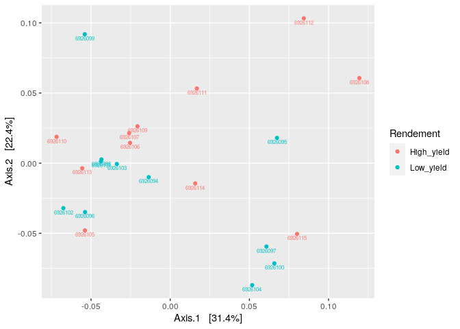
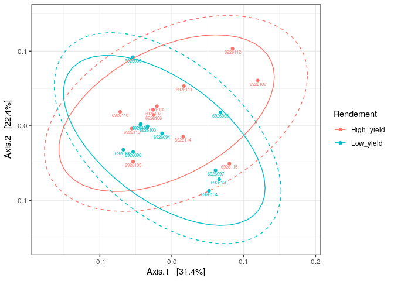
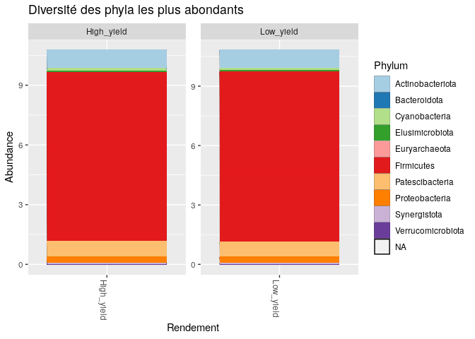
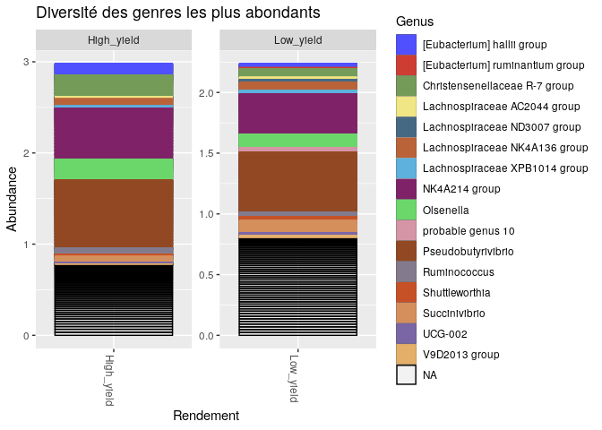
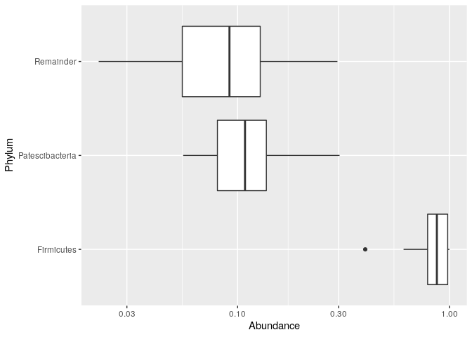

CC3 Microbiote des vaches laitières : analyse phyloseq
================

  - [Création d’un arbre phylogénétique pour le phylum
    Proteobacteria](#création-dun-arbre-phylogénétique-pour-le-phylum-proteobacteria)
  - [Ordination](#ordination)
      - [PCoA avec unifrac](#pcoa-avec-unifrac)
  - [Bar plot](#bar-plot)
      - [Au niveau du Phylum](#au-niveau-du-phylum)
      - [Au niveau du genre](#au-niveau-du-genre)
  - [Abondance avec un diagramme en
    boite](#abondance-avec-un-diagramme-en-boite)

``` r
library(ggplot2)
library(dada2)
```

    ## Loading required package: Rcpp

``` r
library(phyloseq)
library(Biostrings)
```

    ## Loading required package: BiocGenerics

    ## Loading required package: parallel

    ## 
    ## Attaching package: 'BiocGenerics'

    ## The following objects are masked from 'package:parallel':
    ## 
    ##     clusterApply, clusterApplyLB, clusterCall, clusterEvalQ,
    ##     clusterExport, clusterMap, parApply, parCapply, parLapply,
    ##     parLapplyLB, parRapply, parSapply, parSapplyLB

    ## The following objects are masked from 'package:stats':
    ## 
    ##     IQR, mad, sd, var, xtabs

    ## The following objects are masked from 'package:base':
    ## 
    ##     anyDuplicated, append, as.data.frame, basename, cbind, colnames,
    ##     dirname, do.call, duplicated, eval, evalq, Filter, Find, get, grep,
    ##     grepl, intersect, is.unsorted, lapply, Map, mapply, match, mget,
    ##     order, paste, pmax, pmax.int, pmin, pmin.int, Position, rank,
    ##     rbind, Reduce, rownames, sapply, setdiff, sort, table, tapply,
    ##     union, unique, unsplit, which, which.max, which.min

    ## Loading required package: S4Vectors

    ## Loading required package: stats4

    ## 
    ## Attaching package: 'S4Vectors'

    ## The following object is masked from 'package:base':
    ## 
    ##     expand.grid

    ## Loading required package: IRanges

    ## 
    ## Attaching package: 'IRanges'

    ## The following object is masked from 'package:phyloseq':
    ## 
    ##     distance

    ## Loading required package: XVector

    ## 
    ## Attaching package: 'Biostrings'

    ## The following object is masked from 'package:base':
    ## 
    ##     strsplit

``` r
library(DECIPHER)
```

    ## Loading required package: RSQLite

``` r
load("~/EcoG2-CC3_2/02_data_analysis_FinalEnv")
```

``` r
samples.out <- rownames(seqtab.nochim)
rendement <- sapply(strsplit(samples.out, "_"), `[`, 1)
rendement <- (sapply(strsplit(samples.out, "_"), `[`, 1))
genus <- substr(rendement,1,22)
samdf <- data.frame(Rendement=rendement, Genus=genus)
samdf$Rendement <- c("Low_yield","Low_yield","Low_yield","Low_yield","Low_yield","Low_yield","Low_yield","Low_yield","Low_yield","Low_yield","Low_yield","High_yield","High_yield","High_yield","High_yield","High_yield","High_yield","High_yield","High_yield","High_yield","High_yield","High_yield")
samdf$Genus[samdf$Rendement==22] <- c("Actinobacteriota", "Bacteroidota", "Cyanobacteria", "Elusimicrobiota", "Fibrobacterota", "Firmicutes", "Patescibacteria", "Proteobacteria", "Synergistota", "Verrucomicrobiota")
rownames(samdf) <- samples.out
```

``` r
library(DECIPHER)
library(phangorn)
```

    ## Loading required package: ape

    ## 
    ## Attaching package: 'ape'

    ## The following object is masked from 'package:Biostrings':
    ## 
    ##     complement

``` r
seqs <- getSequences(seqtab.nochim)
names(seqs) <- seqs # This propagates to the tip labels of the tree
alignment <- AlignSeqs(DNAStringSet(seqs), anchor=NA,verbose=FALSE)
phangAlign <- phyDat(as(alignment, "matrix"), type="DNA")
dm <- dist.ml(phangAlign)
treeNJ <- NJ(dm) # Note, tip order != sequence order
fit = pml(treeNJ, data=phangAlign)
```

    ## negative edges length changed to 0!

``` r
## negative edges length changed to 0!
fitGTR <- update(fit, k=4, inv=0.2)
fitGTR <- optim.pml(fitGTR, model="GTR", optInv=TRUE, optGamma=TRUE,
        rearrangement = "stochastic", control = pml.control(trace = 0))
detach("package:phangorn", unload=TRUE)
```

# Création d’un arbre phylogénétique pour le phylum Proteobacteria

``` r
ps <- phyloseq(otu_table(seqtab.nochim, taxa_are_rows=FALSE), 
               sample_data(samdf), 
               tax_table(taxa), phy_tree(fitGTR$tree))
ps
```

    ## phyloseq-class experiment-level object
    ## otu_table()   OTU Table:         [ 3816 taxa and 22 samples ]
    ## sample_data() Sample Data:       [ 22 samples by 2 sample variables ]
    ## tax_table()   Taxonomy Table:    [ 3816 taxa by 7 taxonomic ranks ]
    ## phy_tree()    Phylogenetic Tree: [ 3816 tips and 3814 internal nodes ]

``` r
PS.prot = subset_taxa(ps, Phylum == "Proteobacteria")

plot_tree(PS.prot, color = "Rendement", shape = "Order", label.tips = "Family", plot.margin = 0.05, ladderize = TRUE)
```

    ## Warning in psmelt(physeq): The sample variables: 
    ## Genus
    ##  have been renamed to: 
    ## sample_Genus
    ## to avoid conflicts with taxonomic rank names.

<!-- -->

Nous voulions montrer l’arbre des Firmicutes au départ, car c’est le
phylum le plus abondant. Cependant les données étaient tellement
importantes que l’arbree en devenait illisible. Nous avons choisi
d’intégrer un arbre phylogénétique dans notre compte rendu pour le
phylum Proteobacteria. Nous avons testé pour les autres Phyla. À défaut
de bien distinguer le noms des taxons, nous pouvons voir, grâce aux
couleurs des points, que les phyla se retrouvent aussi bien chez les
vaches “Low yield” et “High yield”, et ce, en quantité quasiment
équivalente. Nous avons observé le même type de résultat pour les
autres phyla. Les résultats sont à nuancer car nous avons attribué
manuellement les rendements.

# Ordination

## PCoA avec unifrac

``` r
library(phyloseq)
library(vegan)
```

    ## Loading required package: permute

    ## Loading required package: lattice

    ## This is vegan 2.5-7

``` r
top20 <- names(sort(taxa_sums(ps), decreasing=TRUE))[1:10]
ps.top20 <- transform_sample_counts(ps, function(OTU) OTU/sum(OTU))
ps.top20 <- prune_taxa(top20, ps.top20)

ord = ordinate(ps, "PCoA", "unifrac", weighted = TRUE)
```

    ## Warning in UniFrac(physeq, ...): Randomly assigning root as --
    ## ACAGTGACTCCTACGGGAGGCAGCAGTGGGGAATATTGGGCAATGGGCGAAAGCCTGACCCAGCAACGCCGCGTGAGTGAAGAAGGCTTTCGGGTTGTAAAGCTCTGTTATAGGGGACGAAGGAAGTGACGGTACCCTATAAGGAAGCCCCGGCTAACTACGTGCCAGCAGCCGCGGTAATACGTAGGGGGCGAGCGTTGTCCGGAATGACTGGGCGTAAAGGGCGTGTAGGCGGCCGATTAAGTATGAAGTGAAAGTCCTGCTTTCAAGGTGGGAATTGCTTTGTAGACTGGTTGGCTTGAGTGCGGAAGAGGTAAGTGGAATTCCCAGTGTAGCGGTGAAATGCGTAGAGATTGGGAGGAACACCAGTGGCGAAGGCGACTTACTGGGCCGTAACTGACGCTGAGGCGCGAAAGCGTGGGGAGCGAACAGGATTAGAAACCCTAGTAGTCCTCTGAA
    ## -- in the phylogenetic tree in the data you provided.

``` r
(ordplot <- plot_ordination(ps.top20, ord, "Genus", color="Rendement", shape="SampleType", label="Genus"))
```

    ## Warning in plot_ordination(ps.top20, ord, "Genus", color = "Rendement", : type argument not supported. `type` set to 'samples'.
    ## See `plot_ordination('list')`

    ## Warning in plot_ordination(ps.top20, ord, "Genus", color = "Rendement", : Shape
    ## variable was not found in the available data you provided.No shape mapped.

<!-- -->

``` r
# get data from the plotted ordination. Not strictly necessary but can be useful
orddata <- ordplot$data

# add a fake variable to the experiment
sample_data(ps.top20)$fake <- 1:nsamples(ps.top20)

# get map out of phyloseq object 
map.df <- data.frame(sample_data(ps.top20))
```

``` r
library("ggplot2")
ordplot + 
  stat_ellipse(type = "norm", linetype = 2) +
  stat_ellipse(type = "t") +
  theme_bw()
```

<!-- -->

La PCoA avec l’indice de Bray Curtis ne permet de dinstinguer les deux
communautés (rendement). Tout est mélangé. Cependant, avec l’ajout
d’ellipse, nous pouvons “distinguer” les deux rendements avec deux
orientations différentes. L’orientation ressemble à celles présentées
dans l’article. Néanmoins leur localisation n’est pas la même car ici
elles se confondent contrairement à l’article.

# Bar plot

## Au niveau du Phylum

``` r
library(RColorBrewer)
library(ggsci)
library(RColorBrewer)
top20 <- names(sort(taxa_sums(ps), decreasing=TRUE))[1:3000]
ps.top20 <- transform_sample_counts(ps, function(OTU) OTU/sum(OTU))
ps.top20 <- prune_taxa(top20, ps.top20)


pp =plot_bar(ps.top20, x="Rendement", fill="Phylum", title="Diversité des phyla les plus abondants") +  facet_wrap(~Rendement, scales = "free")
```

    ## Warning in psmelt(physeq): The sample variables: 
    ## Genus
    ##  have been renamed to: 
    ## sample_Genus
    ## to avoid conflicts with taxonomic rank names.

``` r
pp + geom_bar(aes(color=Phylum, fill=Phylum), stat="identity", position="stack") + scale_fill_brewer(palette="Paired") + scale_color_brewer(palette="Paired")
```

<!-- -->

Nos bar plot représentants les différents phyla montrent une abondance
majoritaire des Firmicutes, que ce soit chez les “high yield” et les
“lox yield”. Tandis que dans l’article, ce sont les Bacteroidetes qui
dominents. Nous avons fait le choix de mettre tous les PHyla
contrairement à l’article qui ont mis en avant les 5 phyla les plus
abondants. Nous avons fait ce choix pour bien voir la diversité même si
certains quasiment invisibles.

## Au niveau du genre

``` r
top20 <- names(sort(taxa_sums(ps), decreasing=TRUE))[1:200]
ps.top20 <- transform_sample_counts(ps, function(OTU) OTU/sum(OTU))
ps.top20 <- prune_taxa(top20, ps.top20)
pg <- plot_bar(ps.top20, x="Rendement", fill="Genus", title="Diversité des genres les plus abondants") +  facet_wrap(~Rendement, scales = "free")
```

    ## Warning in psmelt(physeq): The sample variables: 
    ## Genus
    ##  have been renamed to: 
    ## sample_Genus
    ## to avoid conflicts with taxonomic rank names.

``` r
pg + geom_bar(aes(color=Genus, fill=Genus), stat="identity", position="stack")+ scale_color_igv()+ scale_fill_igv()
```

<!-- -->
Sur ces bar plot représentant les genres les plus abondants des
communautés bactériennes. Les genre représentés avec nos bar plot ne
correspondent pas du tout à ceux de l’article. En effet, ce ne sont pas
du tout les mêmes genres. Le genre le plus abondant que ce soit chez les
“high yield” et les “low yield” est Pseudobytyrivibrio. Les NA
correspondent aux traits blancs et noirs. Les deux communautés
contiennent les mêmes genres dans des proportions quasiment égales.
\[Eubacterium\] halliI group est plus abondant chez les “high yield”.

# Abondance avec un diagramme en boite

``` r
library(ggplot2)
library(phyloseq)
library(data.table)
```

    ## 
    ## Attaching package: 'data.table'

    ## The following object is masked from 'package:IRanges':
    ## 
    ##     shift

    ## The following objects are masked from 'package:S4Vectors':
    ## 
    ##     first, second

``` r
# get abundance in %
phy <- transform_sample_counts(ps.top20, function(x) x/sum(x))
# agglomerate taxa
glom <- tax_glom(phy, taxrank = 'Phylum')
# create dataframe from phyloseq object
dat <- data.table(psmelt(glom))
```

    ## Warning in psmelt(glom): The sample variables: 
    ## Genus
    ##  have been renamed to: 
    ## sample_Genus
    ## to avoid conflicts with taxonomic rank names.

``` r
# convert Phylum to a character vector from a factor because R
dat$Phylum <- as.character(dat$Phylum)
# group dataframe by Phylum, calculate median rel. abundance
dat[, median := median(Abundance, na.rm = TRUE), 
    by = "Phylum"]
# Change name to remainder of Phylum less than 1%
dat[(median <= 0.01), Phylum := "Remainder"]
# boxplot
ggplot(dat[Abundance > 0],
       aes(x=Phylum,
           y=Abundance)) + 
  geom_boxplot() + 
  coord_flip() +
  scale_y_log10()
```

<!-- -->

Nous voyons, grâce à ce digramme, que les Firmicutes sont les plus
abondants. Les “remainders” ont des valeurs beaucoup plus large avec un
point extrême tandis que les Firmicutes ont des valeurs beaucoup plus
rapproché, d’où le fait que la moyenne est grande.
